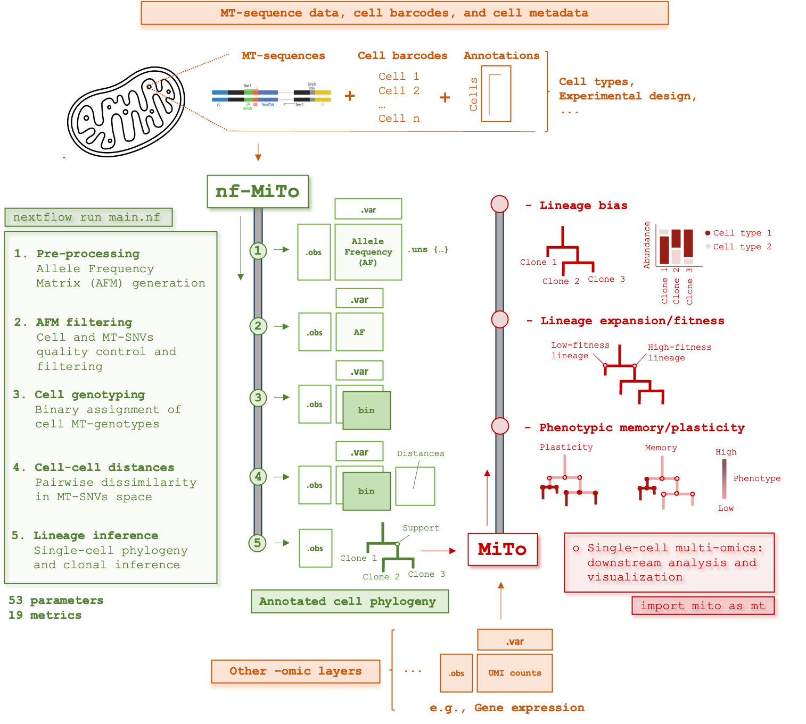

<div align="center">
  
</div>

# MiTo

**Mitochondrial lineage tracing and single-cell multi-omics in Python**

[](https://pypi.org/project/scmito/)
[](https://pypi.org/project/scmito/)
[](https://github.com/andrecossa5/MiTo/actions/workflows/test.yml)
[](https://andrecossa5.readthedocs.io/en/latest/index.html)
[](https://opensource.org/licenses/MIT)
[](https://doi.org/10.1101/2025.06.17.660165)

MiTo turns mitochondrial DNA variation into single-cell phylogenies. It reads
MAESTER, RedeeM, Cas9 and scWGS output into an [AnnData](https://anndata.readthedocs.io/)
Allele Frequency Matrix, selects informative MT-SNVs, calls single-cell genotypes,
computes cell-cell distances in mutational space, and reconstructs and annotates
clonal trees.

## Installation

```bash
pip install scmito
```

Requires Python 3.10–3.12. The import name is `mito`:

```python
import mito as mt
print(mt.__version__)
```

> **Note on the package name.** The distribution is `scmito` on PyPI; earlier
> releases were published as `mito-utils`, which is no longer maintained.

## Quick start

```python
import scanpy as sc
import mito as mt

# Allele Frequency Matrix: an AnnData with AD / DP layers
afm = sc.read('afm_unfiltered.h5ad')

# Cell and variant filtering
afm = mt.pp.filter_cells(afm, cell_filter='filter2')
afm = mt.pp.filter_afm(afm, filtering='MiTo')

# Embedding and neighbourhood structure
mt.pp.reduce_dimensions(afm, method='UMAP')
idx, _, _ = mt.pp.kNN_graph(D=afm.obsp['distances'].toarray(), k=15, from_distances=True)

# Phylogeny and clonal inference
tree = mt.tl.build_tree(afm, precomputed=True, solver='UPMGA')
annotator = mt.tl.MiToTreeAnnotator(tree)
annotator.clonal_inference()

mt.pl.plot_tree(tree, features=['MiTo clone'])
```

A full walkthrough is in the
[getting-started tutorial](https://andrecossa5.readthedocs.io/en/latest/getting_started_tutorial.html).

## API

MiTo follows the scverse layout, so it composes with `scanpy` and `anndata`:

| Module | Purpose |
| --- | --- |
| `mt.io` | Build AFMs from pipeline output (`make_afm`), read/write Newick trees |
| `mt.pp` | Cell and variant filtering, genotype calling, distances, kNN graphs, embeddings |
| `mt.tl` | Tree building, clonal inference, clustering, fate bias, bootstrapping |
| `mt.pl` | Trees, heatmaps, embeddings, coverage and variant-spectrum plots |
| `mt.ut` | Metrics (kBET, ARI, NMI, CI/RI), MT annotations, helpers |

**Supported systems:** MAESTER, RedeeM, Cas9, scWGS.
**Variant filters:** `baseline`, `CV`, `miller2022`, `weng2024`, `MQuad`, `MiTo`, `GT_enriched`.
**Genotyping:** `vanilla` (hard thresholds), `MiTo` (binomial-mixture posteriors).
**Tree solvers:** `UPMGA`, `NJ`, `spectral`, `greedy`.

Full reference: [MiTo docs](https://andrecossa5.readthedocs.io/en/latest/index.html).

## Development

```bash
git clone https://github.com/andrecossa5/MiTo.git
cd MiTo
pip install -e ".[test]"
pytest
```

Optional, matching the scverse template:

```bash
pre-commit install
```

## Citation

If MiTo is useful in your work, please cite:

> Cossa, A. et al. *MiTo: mitochondrial lineage tracing and single-cell multi-omics.*
> bioRxiv (2025). [10.1101/2025.06.17.660165](https://doi.org/10.1101/2025.06.17.660165)

MiTo builds on [Cassiopeia](https://github.com/YosefLab/Cassiopeia) for phylogenetic
reconstruction; please cite it as well when using the tree solvers.

## Releases

See [CHANGELOG.md](CHANGELOG.md).

## License

MIT — see [LICENSE](LICENSE).
